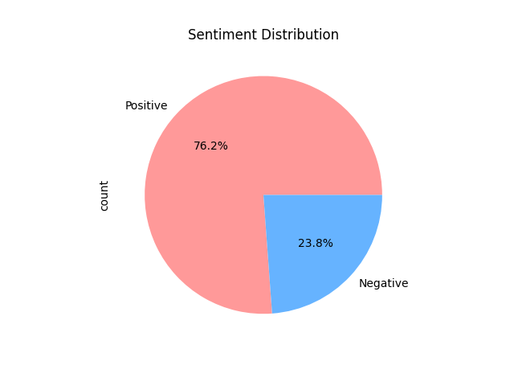
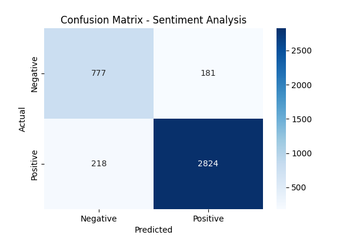
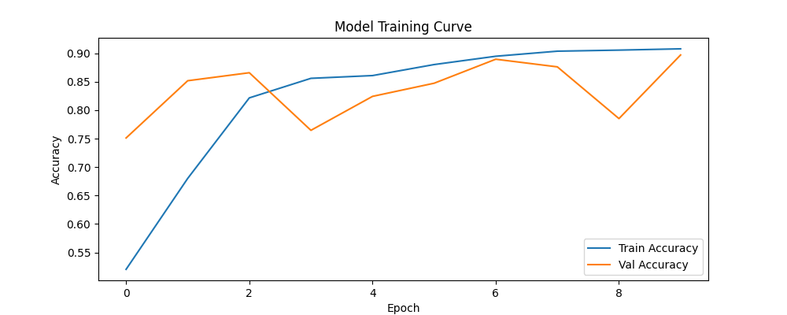
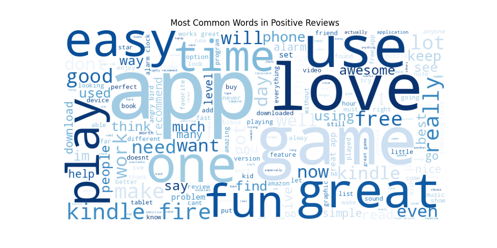
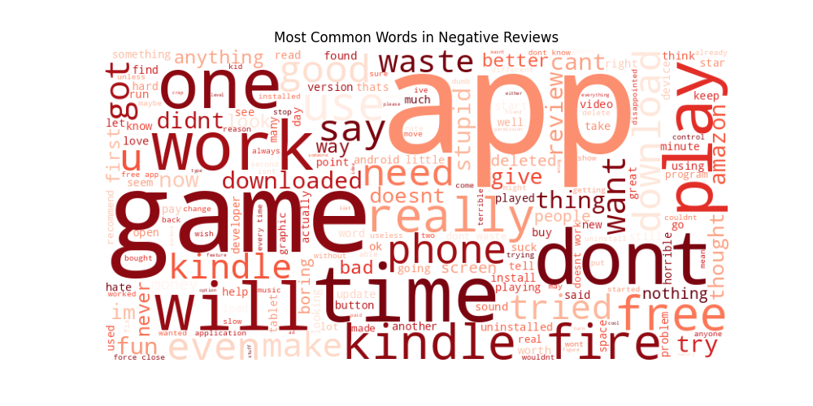

# Amazon Product Reviews - Sentiment Analysis

Classifying Amazon product reviews as Positive or Negative using Deep Learning with NLP techniques.

##  Dataset
- 20,000 Amazon product reviews
- Binary classification: Positive (76.2%) / Negative (23.8%)
- Handled class imbalance using class weights

##  Key Findings
- Positive reviews dominated by words: 'love', 'easy', 'awesome', 'great'
- Negative reviews dominated by: 'dont', 'work', 'waste', 'uninstalled'
- App functionality and usability are key drivers of customer dissatisfaction

##  Methodology
1. **Text Cleaning** - Lowercasing, removing punctuation and special characters
2. **Tokenization** - Top 10,000 words vocabulary with OOV token handling
3. **Sequence Padding** - All reviews padded/truncated to 200 tokens
4. **Class Weights** - Applied to handle 76/24 class imbalance
5. **Evaluation** - Accuracy, Precision, Recall, F1-Score, Confusion Matrix

##  Model Architecture
- Embedding(10000, 64) → GlobalAveragePooling1D → Dense(64, ReLU) → Dropout(0.3) → Dense(1, Sigmoid)
- Optimizer: Adam | Loss: Binary Crossentropy | Epochs: 10

##  Results
- Test Accuracy: **90%**
- Precision (Positive): 0.94 | Recall (Positive): 0.93
- Precision (Negative): 0.78 | Recall (Negative): 0.81

##  Visualizations

## 🛠️ Tech Stack
Python, TensorFlow, Keras, Scikit-learn, Pandas, NumPy, Matplotlib, WordCloud

